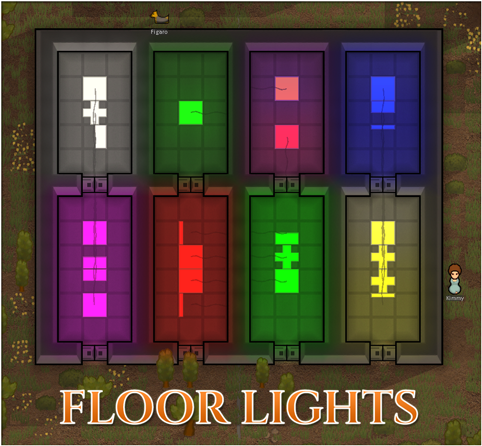

# Floor Lights

Go to [Steam Workshop](https://steamcommunity.com/sharedfiles/filedetails/?id=1541728186) for the Steam version.

## Description
Lights (lamps) that are integrated into the ground. These lamps used to have their power cable hidden underground, but various rim-rodents kept eating them so the cable placement had to be revisited. It is possible to build on top of the floor lights.

### Shapes:
- Square | Power consumption: 24 | Radius: 12
- Plus | Power consumption: 18 | Radius: 9
- Corner | Power consumption: 18 | Radius: 9
- Inverse corner | Power consumption: 6 | Radius: 3
- Stripe | Power consumption: 12 | Radius: 6
- Triangle | Power consumption: 12 | Radius: 6
- Small corner | Power consumption: 7 | Radius: 5
- Small inverse corner | Power consumption: 2 | Radius: 1
- Small stripe | Power consumption: 4 | Radius: 3
- Small middle stripe | Power consumption: 4 | Radius: 3
- Small diagonal stripe | Power consumption: 4 | Radius: 3

### Colors:
- White (normal)
- Red
- Green
- Blue
- Yellow
- Purple

Special thanks to Dingo (A15) and stryth (A14) for keeping this up to date when I couldn't. :)

Translations (Thank you!):
- Chinese (Simplified): =O.W.L.S=o_Onion

## Preview
